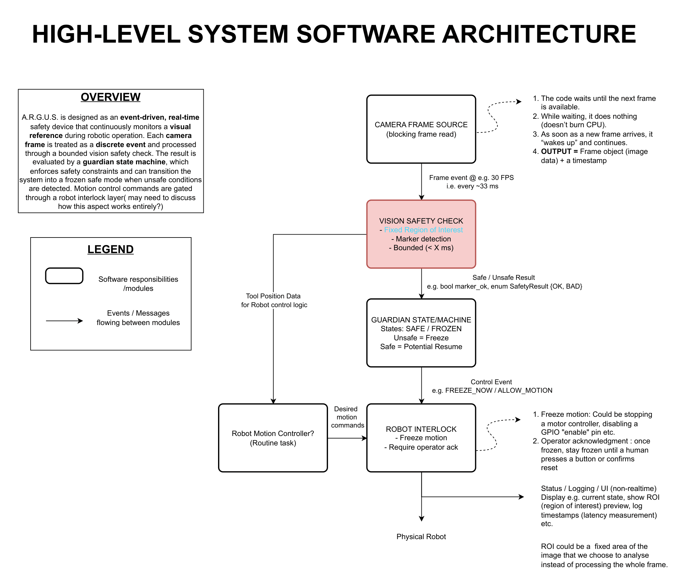
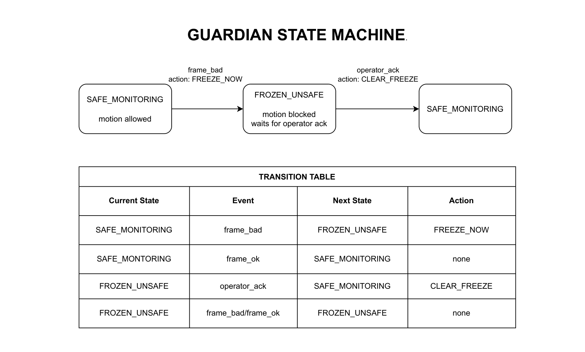
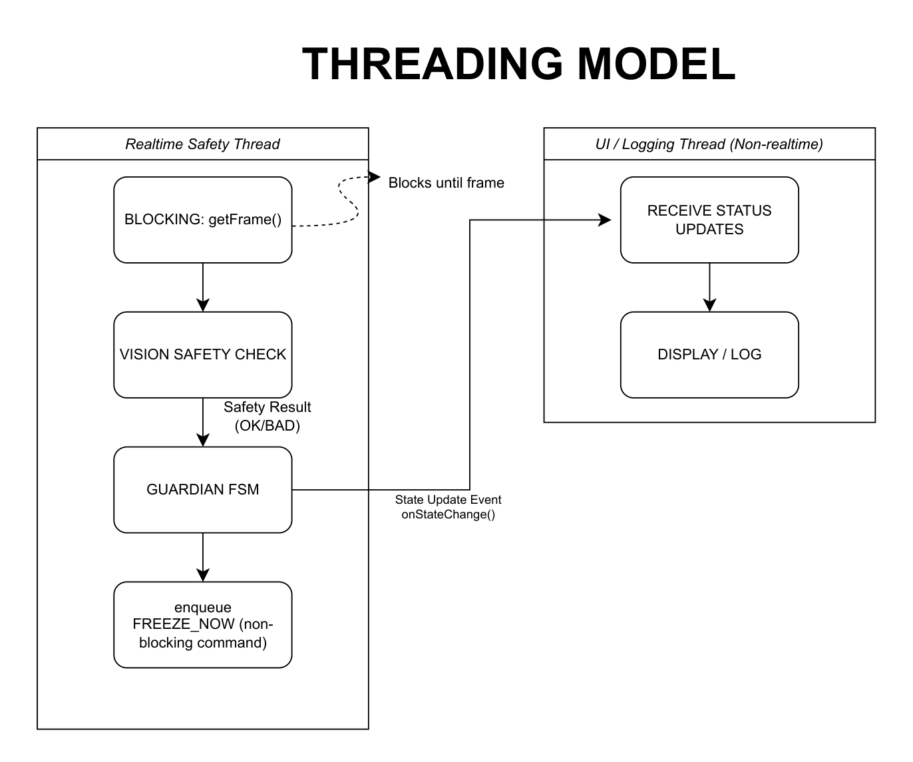
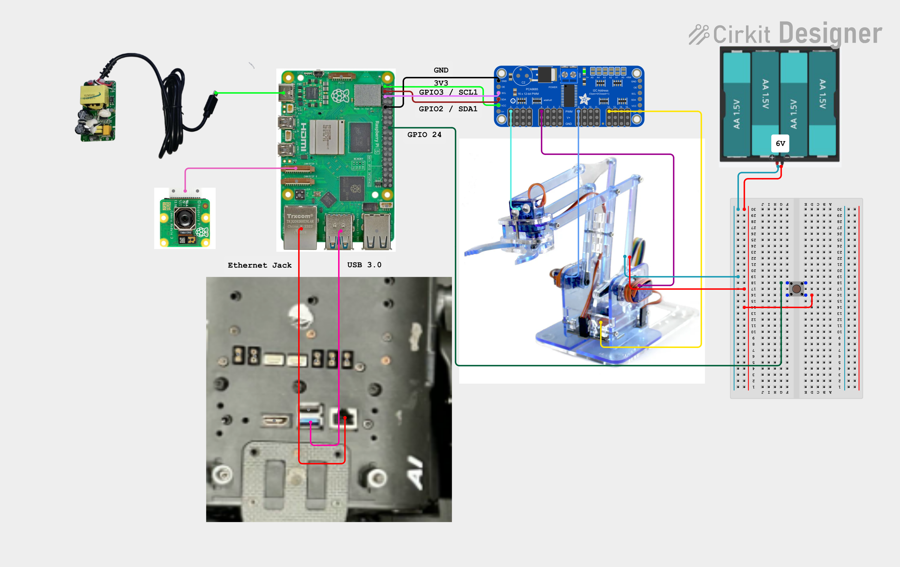

<p align="center">
  
</p>

<h1 align="center">A.R.G.U.S - "Detect. Decide. Stop."</h1>

## Table of Contents
- [Overview](#overview)
- [Real-World Use Case](#real-world-use-case)
- [Requirements](#requirements)
- [System Architecture](#system-architecture)
- [Bill of Materials (BOM)](#bill-of-materials-bom)
- [Installation & Setup](#installation--setup)
- [Hardware Wiring Cheat Sheet](#hardware-wiring-cheat-sheet)
- [Building the Project](#building-the-project)
- [Running the System](#running-the-system)
- [Testing](#testing)
- [Project Structure](#project-structure)
- [Core Components](#core-components)
- [Real-Time Design & Latency](#real-time-design--latency)
- [Documentation](#documentation)
- [Social Media & PR](#social-media--pr)
- [Authors & Contributions](#authors--contributions)
- [Acknowledgements](#acknowledgements)
- [License](#license)
- [Future Work](#future-work)

---

## Overview
<p align="justify"> A.R.G.U.S (Adaptive Real-Time Guardian for Unsafe Situations) is a real-time, vision-based safety system for robotic manipulators, designed for high-risk environments such as surgical robotics and industrial automation. It continuously monitors the workspace - particularly during critical operations like instrument exchange - where unexpected motion can cause damage or injury. By analysing visual input under strict latency constraints, A.R.G.U.S. detects deviations from expected conditions and immediately triggers fail-safe interventions (e.g. hard stops) using event-driven control. This ensures deterministic, reliable interruption of motion, preventing accidents before they occur.</p>

<p align="center">
  
  
</p>
*Validated ARGUS bench setup on Raspberry Pi 5 with Pi Camera, PCA9685 and MeArm platform.*

### Current validated implementation
This branch is the first fully working Raspberry Pi hardware baseline for ARGUS. The currently validated runtime path is:

`AppController -> CameraCapture -> VisionProcessor -> GuardianStateMachine -> RobotInterlock -> MotionController`

It has been exercised on real hardware with:
- Raspberry Pi 5
- Raspberry Pi camera
- PCA9685 servo driver
- MeArm test platform
- physical operator button

Current implemented capabilities:
- live camera capture on Raspberry Pi
- colour-based forbidden-layer safety evaluation
- guardian freeze / recover logic
- interlock-gated motion
- PCA9685-backed servo output
- per-joint logical angle to pulse calibration
- motion smoke tests
- raw servo calibration mode
- physical button test mode
- live surgery-cut routine, manual mode, and real-time supervisory dashboards

---

## Real-World Use Case
A.R.G.U.S is designed for **safety-critical environments**, including:

- Surgical robotics (instrument exchange safety)
- Industrial robotic arms (collision prevention)
- Human-robot collaboration systems

During operations such as **tool exchange**, unexpected motion can cause injury or system failure. A.R.G.U.S ensures the robot only operates under valid conditions, stopping instantly when anomalies occur.

## Requirements

### Functional requirements

| ID | Requirement | Status |
|----|-------------|--------|
| FR-1 | System shall detect forbidden-layer colour in real time at ≥ 30 FPS | Implemented |
| FR-2 | System shall issue freeze within the defined software latency budget after unsafe detection | Implemented |
| FR-3 | System shall require operator acknowledgement before resuming motion after a freeze | Implemented |
| FR-4 | System shall support multiple run modes (live test, smoke test, calibration, demo) | Implemented |
| FR-5 | System shall log latency metrics for real-time performance validation | Implemented |

### Non-functional requirements

| ID | Requirement | Status |
|----|-------------|--------|
| NFR-1 | All safety-critical code shall be event-driven with no blocking `sleep()` calls | Implemented |
| NFR-2 | Vision processing shall complete within a bounded time per frame | Implemented |
| NFR-3 | System shall build and run on Raspberry Pi 5 with standard packages | Validated |
| NFR-4 | Code shall follow SOLID principles with clear class encapsulation | Implemented |
| NFR-5 | Public API documentation shall be available and kept in sync with code changes | In progress |

### Current project focus
The current branch validates that safety workflow on a small real arm using colour-based depth supervision:
- safe scene required before motion
- freeze on unsafe visual state
- operator acknowledgement required for recovery
- motion always routed through the existing guardian/interlock path

---

## System Architecture
### High-Level Software Architecture


*Event-driven pipeline: each camera frame is a discrete event processed through bounded vision checks, guardian state evaluation and interlock-gated motion control.*

### Guardian State Machine


*Deterministic three-state FSM: SAFE_MONITORING -> FROZEN_UNSAFE -> RESET_PENDING, with explicit operator acknowledgement before full recovery.*

### Vision Safety Pipeline

[Vision safety pipeline diagram (PDF)](docs/architecture/Vision_Safety_Pipeline.pdf)
*Bounded processing pipeline: ROI extraction -> colour detection -> safety evaluation, all within a measurable latency budget.*

### Threading Model


*Camera and button input run on dedicated producer threads; the main control loop consumes queued events and drives guardian/interlock decisions.*

- Camera input → event stream
- Region of Interest (ROI) validation
- Guardian state machine
- Fail-safe controller (stop signal)

### Current validated software path
`AppController -> CameraCapture -> VisionProcessor -> GuardianStateMachine -> RobotInterlock -> MotionController`

### Current guarded hardware path
- CameraCapture acquires frames on the Pi
- VisionProcessor evaluates forbidden-layer colour exposure inside ROI
- GuardianStateMachine decides freeze / recovery transitions
- RobotInterlock blocks or allows motion
- MotionController drives the PCA9685 servo output path
- PhysicalButtonModule emits operator button events that AppController routes through the same guarded flow

---

## Bill of Materials (BOM)

### Controller
| Component | Quantity | Cost (£) |
|----------|---------|----------|
| Raspberry Pi 5 | 1 | Not tracked in repo |

### Sensors & Vision
| Component | Quantity | Cost (£) |
|----------|---------|----------|
| Raspberry Pi Camera Module | 1 | Not tracked in repo |

### Additional Components
| Component | Quantity | Cost (£) |
|----------|---------|----------|
| MeArm test platform | 1 | Not tracked in repo |

**Total Cost:** Not tracked in the repository.

### Current validated bench hardware
| Component | Quantity | Notes |
|----------|---------|-------|
| Raspberry Pi 5 | 1 | validated target |
| Raspberry Pi camera | 1 | used with `libcamerify` |
| Adafruit PCA9685 | 1 | I2C servo driver |
| MeArm | 1 | 4-servo arm |
| Servos | 4 | base / lower / upper / grip |
| Momentary tactile button | 1 | active-low physical continue / ACK |
| External 6V battery pack | 1 | servo power |

---

## Installation & Setup

### Requirements
- Linux (Raspberry Pi OS)
- C++17+
- CMake ≥ 3.10
- OpenCV
- pkg-config
- libcamera runtime tools on the Pi

### Install Dependencies
```bash
sudo apt update
sudo apt install -y build-essential cmake pkg-config libopencv-dev libcamera-tools
```

### Current validated Raspberry Pi packages
```bash
sudo apt update
sudo apt install -y build-essential cmake pkg-config libopencv-dev libcamera-tools
```

### Bundled Bernd compliance backend packages
To build the bundled `libcamera2opencv` backend in this repo:
```bash
sudo apt install -y libcamera-dev libturbojpeg0-dev
```

Then configure and build ARGUS. The vendored backend will be compiled
automatically when the dependencies are present:
```bash
cmake -S . -B build
cmake --build build -j$(nproc)
```

### Setup notes for this branch
- use the wrapper scripts for Pi camera modes; they try the compliance backend
  first and use `libcamerify` only for the OpenCV/V4L2 fallback path
- `live_test.sh` self-elevates with `sudo` because the physical button uses the GPIO character-device interface
- `--expected-marker-id` is kept as a legacy CLI flag for compatibility
- the project vendors Bernd Porr `cppTimer` and `libcamera2opencv` under `third_party/`
- in auto mode, camera capture now tries the bundled Bernd backend first and
  falls back to the older OpenCV/V4L2 path only if that fails
- you can force the Bernd camera backend with:
  `ARGUS_CAMERA_BACKEND=libcamera2opencv`
- third-party licensing and attribution are documented in
  [THIRD_PARTY_NOTICES.md](THIRD_PARTY_NOTICES.md)

---

## Hardware Wiring Cheat Sheet


*Complete system wiring: Raspberry Pi 5 → PCA9685 servo driver (I2C via GPIO2/GPIO3), Pi Camera (ribbon cable), MeArm with four servos, external 6V battery pack, and operator button on GPIO24 via breadboard.*

### Raspberry Pi to PCA9685
- Pi `3V3` -> PCA9685 `VCC`
- Pi `GND` -> PCA9685 `GND`
- Pi `GPIO2 / SDA1` (physical pin `3`) -> PCA9685 `SDA`
- Pi `GPIO3 / SCL1` (physical pin `5`) -> PCA9685 `SCL`

### Servo power
- External `6V` battery pack -> MeArm board / servo power rail
- Pi ground, PCA9685 ground, battery ground, and MeArm ground must all be shared
- Do not power the servos from the Pi

### PCA9685 channel mapping
- `channel 0` -> `base` -> MeArm `BASE`
- `channel 4` -> `lower` -> MeArm `LEFT`
- `channel 8` -> `upper` -> MeArm `RIGHT`
- `channel 12` -> `grip` -> MeArm `CLAW`

### Current logical angle calibration
- base: `-90 -> 100`, `0 -> 300`, `+90 -> 500`
- lower: `-90 -> 100`, `0 -> 300`, `+90 -> 500`
- upper: `-90 -> 100`, `0 -> 290`, `+90 -> 500`
- grip: `-90 -> 100`, `0 -> 300`, `+90 -> 500`

### Rear-view arm semantics
- `base`: rotates the whole arm left / right
- `lower`: left-side servo, raises / lowers the lower link
- `upper`: right-side servo, bends / extends the upper link
- `grip`: opens / closes the claw

### Physical button
- BCM `GPIO24`, physical pin `18`
- one side of the button -> `GPIO24`
- opposite side -> `GND`
- active-low input with pull-up
- place a 4-pin tactile button across the breadboard center gap
- do not wire `GPIO24` and `GND` to two legs on the same side of the tactile button

### Camera ribbon
- use `CAM/DISP0` or `CAM/DISP1` on the Pi 5
- power the Pi off before plugging or unplugging the cable
- on the Pi side, ribbon pads face away from the latch
- on the camera side, ribbon pads face toward the camera PCB

### Quick fault isolation
- if all servos chatter together, check shared power and ground first
- if only one joint misbehaves, check that joint's linkage, orientation, and signal wire
- if the button state is stuck or inverted, check tactile button orientation first

---

## Building the Project

```bash
git clone git@github.com:ENG5220-RTEP-Team-ARGUS/ARGUS.git --recursive
cd ARGUS

cmake -S . -B build
cmake --build build -j$(nproc)
```

### Current validated build flow
From repository root:

```bash
cmake -S . -B build
cmake --build build -j$(nproc)
```

If CMake fails with `Could not find OpenCVConfig.cmake`, install or configure the OpenCV development packages so `find_package(OpenCV REQUIRED)` succeeds.

---

## Running the System

### Current validated run modes

#### 1) Guardian FSM scenario demo
Runs built-in state-machine scenarios without live camera or hardware motion:

```bash
./build/ARGUS
```

#### 2) Camera backend compliance check
Runs a short capture validation pass and prints backend/frame summary stats:

```bash
./scripts/camera_backend_check.sh
```

or directly:

```bash
./build/ARGUS --camera-backend-check --camera-index 0 --camera-backend libcamera2opencv
```

Notes:
- wrapper default: checks `libcamera2opencv` first, then validates the OpenCV fallback
- use `--camera-backend <name>` to force a single backend
- this mode is intended for repeatable Pi backend validation logs

#### 3) Live safety test
Recommended on Raspberry Pi:

```bash
./scripts/live_test.sh
```

Options:
- `--camera-index <n>`: camera index, default `0`
- `--expected-marker-id <n>`: legacy compatibility flag (not used by colour-depth trigger)
- `--camera-backend <name>`: `auto`, `libcamera2opencv`, or `opencv`
- `--auto-ack`: auto-send operator acknowledge when frozen
- `--help`: print usage

Notes:
- `./scripts/live_test.sh` uses default camera index `0`
- by default the wrapper tries `libcamera2opencv` first and falls back to the
  older OpenCV/V4L2 path only if that run fails
- if you want to force a backend explicitly, pass `--camera-backend`

#### 4) Motion smoke test
Runs a motion-only servo sweep through the existing `AppController -> MotionController` path:

```bash
./build/ARGUS --motion-smoke-test --base
./build/ARGUS --motion-smoke-test --lower
./build/ARGUS --motion-smoke-test --upper
./build/ARGUS --motion-smoke-test --grip
```

Convenience wrappers:
- `scripts/smoke_all.sh`
- `scripts/smoke_base.sh`
- `scripts/smoke_lower.sh`
- `scripts/smoke_upper.sh`
- `scripts/smoke_grip.sh`

Selected joint pattern:
1. Move all joints to home
2. Move the selected joint `0 -> -90 -> +90 -> 0`
3. Hold each step for about 3 seconds

#### 5) Move all joints to home
Moves all joints to logical `0` / home and exits:

```bash
./scripts/set_home.sh
```

or directly:

```bash
./build/ARGUS --motion-home
```

#### 6) Interactive servo console
Runs an interactive terminal console for direct joint positioning through the existing motion path:

```bash
./scripts/servo_console.sh
```

or directly:

```bash
./build/ARGUS --servo-console
```

Usage examples:
- `base 90`
- `lower -30`
- `upper 45`
- `grip 10`
- `home`
- `status`

Behavior:
- commands set one joint while keeping the others at their current logical positions
- logical range is clamped to `-90..+90`
- use `Ctrl+C` or `exit` to quit

#### 7) Controller-style servo drive
Runs a key-driven teleop wrapper on top of `--servo-console` so you can nudge joints without typing full commands:

```bash
./scripts/servo_drive.sh
```

Default keymap presets:
- `azerty`: `d` / `q` base left/right, `z` / `s` upper forward/backward, `i` / `k` lower up/down, `l` / `j` grip open/close
- `qwerty`: `a` rotate left (anti-clockwise), `d` rotate right (clockwise), `w` forward, `s` backward, `i` up, `k` down, `j` open, `l` close
- `h`: home (all joints to 0)
- `r`: status
- `+` / `-`: increase / decrease step size
- `x`: go home, wait briefly, then exit

Notes:
- startup asks for keymap preset (`azerty`, `qwerty`, `mouse-azerty`, `mouse-qwerty`, or `custom`)
- `custom` asks one binding at a time
- default step is `5` logical degrees
- override step with `ARGUS_SERVO_STEP` (for example `ARGUS_SERVO_STEP=2 ./scripts/servo_drive.sh`)
- default exit-home wait is `1.0s`; override with `ARGUS_SERVO_EXIT_HOME_WAIT_S`
- skip startup prompt with `ARGUS_SERVO_KEYMAP=<preset>`
- logical range is clamped to `-90..+90`

#### 8) Servo calibration console
Runs a raw-pulse calibration console for matching physical horn angle to PCA9685 pulse ticks:

```bash
./scripts/servo_calibrate.sh
```

or directly:

```bash
./build/ARGUS --servo-calibrate
```

Usage examples:
- `base 320`
- `base +5`
- `base -5`
- `mark base 0`
- `mark base +90`
- `mark base -90`
- `summary`
- `write`

Behavior:
- commands use raw PCA9685 pulse ticks, not logical degrees
- one joint can be moved while the others stay where they are
- `mark` stores the current pulse for that joint at `-90`, `0`, or `+90`
- `summary` prints all saved calibration points
- `write` saves the current summary to `config/servo_calibration_latest.txt`
- use `Ctrl+C` or `exit` to quit

#### 9) Physical button test
Runs the GPIO-backed physical button module by itself:

```bash
./scripts/test_button.sh
```

or directly:

```bash
sudo -E ./build/ARGUS --button-test
```

#### 10) Legacy full-demo alias
`full_demo.sh` is kept as a compatibility wrapper and now forwards to live test:

```bash
./scripts/full_demo.sh --camera-index 0
```

Default routine (`SURGERY_CUT`) sequence:
- `Grip +90 (tool hold)`
- `Cut P1: forward -> down -> backward`
- `Cut P2: forward -> deeper down -> backward`
- `Cut P3: forward -> failure-depth down -> backward`
- `Home`

If an unsafe condition is detected at any point:
- routine progression is stopped
- retract-safe is executed
- freeze is issued and motion remains blocked until safe-again + operator control

Live-test controls:
- `space`: single-button control (arm / disarm / acknowledge, depending on state)
- `0`: select manual mode
- `1`: select routine 1 (`SURGERY_CUT`)
- `2`: select routine 2 (`BASE_SCAN`)
- `3`: select routine 3 (`GRIP_PULSE`)
- `esc`: quit
- manual mode (`0`) keys: `d/a` base left/right, `w/s` forward/backward, `i/k` up/down, `l/j` open/close

Physical button behavior:
- in live mode, the physical button is the default single-button operator control
- if disarmed and safe, press it to arm/start motion
- if armed and running, press it again to disarm
- if frozen and safe again, press it to acknowledge and resume

GPIO overrides:
- `ARGUS_BUTTON_ACK_GPIO` defaults to `24`
- `ARGUS_BUTTON_ARM_GPIO` and `ARGUS_BUTTON_DISARM_GPIO` remain optional, but
  the default operator contract uses a single physical continue button
- `ARGUS_BUTTON_ACTIVE_LOW` defaults to `1`
- `ARGUS_BUTTON_DEBOUNCE_MS` defaults to `50`

---
## GUI & Runtime Overlay

During live operation, A.R.G.U.S. displays a real-time OpenCV overlay window showing the camera feed annotated with system state and diagnostic information.

[Control dashboard concept](docs/architecture/Control%20final%20version.png)
*Current OpenCV dashboards show camera state, guardian/interlock state, forbidden colour thresholds, and timing metrics.*

### Overlay elements

The overlay renders the following in real time:

| Element | Description |
|---------|-------------|
| **VISION** | Current vision processor result (SAFE / UNSAFE + reason) |
| **GUARDIAN** | FSM state (SAFE_MONITORING / FROZEN_UNSAFE) |
| **INTERLOCK** | Whether motion is ALLOWED or BLOCKED |
| **CONTROL** | Armed / disarmed status |
| **POSE** | Current routine step or manual pose stage |
| **DEMO** | Currently selected motion routine |
| **FREEZE** | Freeze reason when motion is stopped |
| **FORBIDDEN COLOUR** | Current HSV target and pixel-threshold tuning |

### Latency metrics displayed

The runtime surfaces software-side latency measurements in terminal logs and in the metrics dashboard:

| Metric | What it measures |
|--------|-----------------|
| `vision_us` | Time inside `VisionProcessor::process()` per frame |
| `unsafe_detect_ms` | Frame capture to unsafe decision |
| `freeze_pipeline_ms` | Unsafe decision to guardian/interlock freeze callback |
| `freeze_cmd_ms` | Freeze callback to motion stop command |
| `total_stop_ms` | End-to-end: capture of first unsafe frame to motion stop |
| `ack_to_resume_ms` | Operator acknowledge to motion re-enable |

These metrics support the real-time latency budget analysis described in the [Real-Time Design](#real-time-design--latency) section.

## Testing

```bash
cmake -S . -B build
cmake --build build -j$(nproc)
ctest --test-dir build --output-on-failure
```

### Current validated test workflow
1. Start in `DISARMED` mode.
2. Position the scene and ensure the unsafe colour is not visible in ROI.
3. Wait until the current reading is safe.
4. Press `space` or the physical button to arm enforcement.
5. Trigger unsafe visual state (forbidden colour visible) and verify retract + freeze.
6. Restore a safe view.
7. Press `space` or the physical button to acknowledge and recover.
8. Press `space` again to disarm when needed.
9. Press `esc` to exit.

### Hardware validation completed
Validated on real hardware:
- motion smoke tests
- live routine loop
- camera capture
- physical button input
- freeze / safe-again / resume path
- rebuild-from-scratch repeatability on a second day

### What you should see
In terminal:
- `armed=YES/NO`
- `can_arm=YES/NO`
- `vision=...`
- `guardian=...`
- `interlock=...`
- `motion_ctrl=...`
- `freeze_reason=...`

In the OpenCV window:
- live camera + status + metrics dashboards
- current safety state and next action
- routine/mode and pose stage
- forbidden colour swatch and HSV/threshold settings
- latency bars and focus signal

---

## Project Structure

```
config/              # Configuration files
docs/architecture/   # System diagrams
include/             # Header files
src/                 # Core implementation
tests/               # Unit tests
```

### Current branch additions
```text
scripts/             # Pi helper scripts for smoke tests, calibration, button test, camera check, and home pose
build/               # out-of-tree build directory used by the validated flow
```

---

## Core Components

### Vision Processor
- Processes camera frames as events
- Extracts ROI and validates signal

### Guardian State Machine
- Encodes `SAFE` / `UNSAFE` states
- Handles transitions deterministically

### Motion Controller
- Issues stop signals
- Interfaces with robotic system

### Current implemented modules

#### AppController
- top-level orchestration for scenario demo, live test, smoke test, servo calibration, button test, and camera checks

#### CameraCapture
- Pi-oriented camera acquisition with V4L2-first behavior under `libcamerify`

#### RobotInterlock
- hardware-facing gate that blocks or allows motion

#### PhysicalButtonModule
- active-low GPIO-backed operator input with software debounce and semantic events

---

## Real-Time Design & Latency

- Frame-based safety pipeline
- Timer-driven control pacing via vendored `cppTimer`
- Safety decisions and control transitions should be measured using
  `std::chrono::steady_clock`

### Latency metrics that matter

The main latency question in ARGUS is not just "how long does vision take?".
It is "how long does it take to go from seeing an unsafe condition to sending
the stop command?".

Recommended software-side metrics:

- `vision_us`
  - Time spent inside `VisionProcessor::process()`.
  - This is the pure vision-processing cost per frame.

- `unsafe_detect_ms`
  - Time from frame capture to the point where the system decides that frame is
    unsafe.
  - This is the first detection latency.

- `freeze_pipeline_ms`
  - Time from "unsafe decision made" to the guardian/interlock freeze callback
    being triggered.
  - This shows how much delay the software control path adds after vision has
    already decided the scene is unsafe.

- `freeze_cmd_ms`
  - Time from entering the freeze callback to the motion stop command being sent
    through `RobotInterlock` / `MotionController`.
  - This is the software actuation latency.

- `total_stop_ms`
  - Time from capture of the first unsafe frame to the motion stop command being
    issued.
  - This is the main end-to-end software safety latency.

Recovery-side metric:

- `ack_to_resume_ms`
  - Time from operator continue / acknowledge input to motion re-enable.

### Important limitation

ARGUS can measure software-command latency, but not true physical stop latency.

That means the current code can measure:
- when the unsafe condition was detected
- when freeze was commanded
- when motion output was disabled or re-enabled in software

It cannot directly measure:
- the exact moment the servo horn physically stopped moving
- the exact moment mechanical motion resumed

Those physical timings would need extra sensing, for example:
- encoder feedback
- a logic analyser on output lines
- an external high-speed camera
- another motion sensor

So in this project the latency numbers should be described as software or
command latency unless external measurement hardware is added.

### Current runtime notes
- live test freezes after `15` consecutive bad frames and recovers after `3` good frames
- live test shows focus score and safety overlays to support setup and debugging
- live test now shows these software-side latency values directly in the GUI:
  - `vision_us` sparkline
  - event bars for `unsafe_detect_ms`, `freeze_pipeline_ms`, and `total_stop_ms`
- detailed values (`freeze_cmd_ms`, `ack_to_resume_ms`) are logged in terminal latency events

---

## Documentation

### Doxygen API Reference

Full API documentation is auto-generated from source comments:

🔗 [Browse Doxygen Docs](https://eng5220-rtep-team-argus.github.io/ARGUS/doxygen/html/)

To regenerate locally:

```bash
doxygen Doxyfile
open docs/doxygen/html/index.html
```

### Camera backend notes
- in `libcamerify` mode, capture enforces a V4L2-first open policy
- startup logs show which backend/path was used
- if frames fail repeatedly, check:

```bash
v4l2-ctl --list-devices
v4l2-ctl --list-formats-ext -d /dev/video0
```
---

## Social Media & PR

-  [Instagram](https://www.instagram.com/argus102026/)
-  [YouTube](https://www.youtube.com/@argus-w3g)
-  [LinkedIn](https://www.linkedin.com/company/a-r-g-u-s)
-  [TikTok](https://www.tiktok.com/@argusxisx61?_r=1&_t=ZN-95E4anYeInm)

## Demonstration Videos

| Demo | Description | Link |
|------|-------------|------|
| Full pipeline demo | Live freeze/recovery | Pending final upload |
| Motion smoke test | All four joints sweeping through full range | Pending final upload |

### Platform Performance Summary
---

## Authors & Contributions

| Name | Component Ownership | Key Contributions |
|------|-------------------|-------------------|
| Nathan Sidi Bakari| MotionController, AppController | Servo output path, PCA9685 driver integration, run modes, CLI interface, hardware wiring |
| Patricia Munginga | VisionProcessor | Vision safety pipeline, colour detection, Doxygen documentation, PR reviews, social media content |
| Jui Ning Chin | GuardianStateMachine | FSM design and implementation, state transitions, freeze/recovery logic, social media content|
| Liyue Tian | CameraCapture | Camera acquisition pipeline, libcamera2opencv integration, V4L2 fallback, social media content |
| Nigar Baghirova | RobotInterlock | Interlock gate logic, atomic state management, motion enable/disable, social media content|

### Project management

This project is tracked using [GitHub Projects](https://github.com/orgs/ENG5220-RTEP-Team-ARGUS/projects). The project board tracks all issues, bugs and tasks with clear ownership per team member.

Key project management practices:
- Branch protection on `main` requiring PR reviews before merge
- Feature branches per component (`feature/vision-processor`, `feature/motion-controller`, etc.)
- Ordered PR merge strategy to avoid conflicts on shared files
- Issues linked to specific fixes with assignees and labels

---

## Acknowledgements

- **Dr Bernd Porr** and **Dr Chongfeng Wei** - course lecturers, ENG5220 Real-Time Embedded Programming
- **Teaching assistants** — lab support and coding standard guidance
- **Bernd Porr's open-source libraries** - [cppTimer](https://github.com/berndporr/cppTimer) and [libcamera2opencv](https://github.com/berndporr/libcamera2opencv), vendored under `third_party/` with GPL licensing
- **University of Glasgow, School of Engineering** - lab facilities and hardware budget

---

## License

This repository is mixed-license:

- original ARGUS code outside `third_party/` is licensed under the MIT License
- vendored Bernd Porr components under `third_party/` keep their original GPL
  licenses
- attribution and file-level licensing details are listed in
  [THIRD_PARTY_NOTICES.md](THIRD_PARTY_NOTICES.md)
- if you redistribute a build of `ARGUS` that includes the vendored GPL
  components, you must comply with those GPL terms

See [LICENSE](LICENSE) for the
repository-level licensing note.

---

## Future Work

- [ ] Multi-camera integration
- [ ] Advanced risk prediction
- [ ] Full robotic system integration
- [ ] Improved latency optimisation
- [ ] More formal automated testing
- [ ] Cleaner runtime logging
- [ ] Additional operator controls
